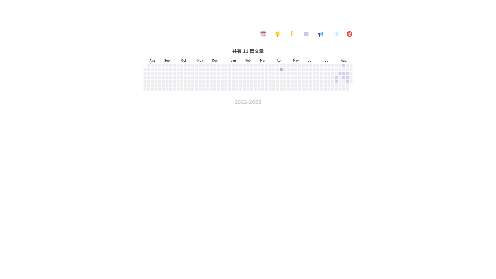

## Preview

https://nextjs.oeyoewl.top

## Features

- 全文 RSS 输出
- Echarts 文章日历统计
- SSG 静态生成
- 借助 contentlayer 和 next-contentlayer, 几乎不需要写一行逻辑代码, 你只需要关注 UI 代码即可

## TODO

- 添加短句功能
- https://saber2pr.top/#/blog/%E5%8D%9A%E5%AE%A2%E5%BB%BA%E8%AE%BE%E6%97%A5%E5%BF%97/%E5%8D%9A%E5%AE%A2%E5%89%8D%E5%8F%B0%E7%9A%84%E6%9B%B4%E6%96%B0%E7%A8%8B%E5%BA%8F%E5%8F%91%E5%B8%83%EF%BC%81 使用 api 更新博客
